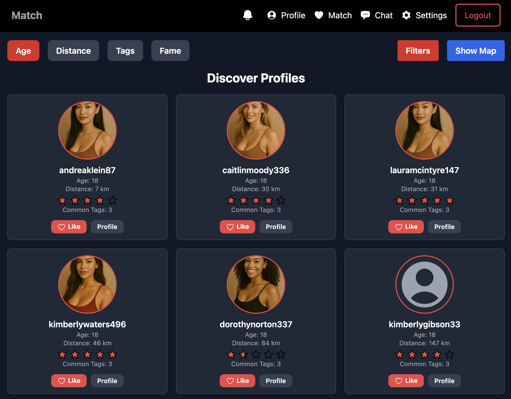
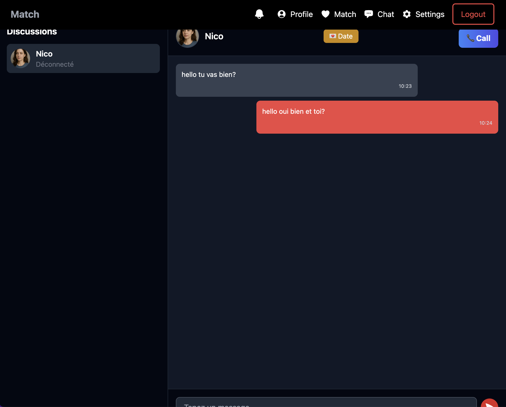

# Matcha — Modern Dating Platform

> Because love too can be industrialized.

## Description

**Matcha** is a complete dating web application that allows users to register, create detailed profiles, browse and filter other users, express interest, chat in real-time, and receive notifications — all with a responsive and secure design.

This project was entirely developed by me and jreivilo as part of the 42 curriculum.

## Main Features

- Secure authentication (email confirmation, password reset, logout)
- Profile management (gender, orientation, bio, tags, profile pictures...)
- Geolocation (with manual override)
- Smart profile suggestions and matching
- Advanced filtering and sorting (age, location, fame rating, shared tags)
- Real-time notifications (views, likes, messages...)
- Real-time chat between matched users
- Block and report system
- Mobile-friendly and responsive UI
- Bonus Google OAuth2 login **implemented** but available **only for test accounts** (Google in dev mode)
- Bonus Interactive user map
- Bonus image additions via OAuth2
- Bonus Video call system
- Bonus Date planning system
- Bonus typing in chat

## Getting Started

### Docker + Makefile

This project runs fully in Docker. Three main commands are available via the `Makefile`:

- `make dev` — Launch the app in **development mode** via NGINX (`https://127.0.0.1`)
- `make prod` — Launch the app in **production mode** via NGINX (`https://127.0.0.1`)
- `make insert_all` — Populate the database with test profiles  
  ⚠️ Use this command **only if** your database is empty!

### Access the App

Once launched:
- Visit [`https://127.0.0.1`](https://127.0.0.1)
- Email-based login works correctly
- Google OAuth2 login is **implemented** but in **development mode**, meaning it only works with pre-authorized Google accounts

## Screenshots (to be added)

You can insert images to illustrate features:

Figure 1: Homepage view on desktop.

Figure 2: Profile page view on desktop.

Figure 3: Search page view on desktop.

Figure 4: Chat Interface view on desktop.

## Tech Stack
- Frontend: React + Tailwind CSS
- Backend: FastAPI (async) + WebSockets
- Database: PostgreSQL
- Authentication & Security: JWT, HttpOnly cookies, bcrypt hashing, email validation
- WebSockets: Real-time chat & notifications
- Docker: Multi-container (frontend, backend, db, nginx)
- NGINX: HTTPS proxy with self-signed certs in dev

## Important Notes
- All secrets and API keys are stored in a .env file and excluded from Git
- A "like" must be mutual to open a chat (matching system)
- Users can be blocked or reported at any time
- SQL queries are manually written and protected from injection
- All forms and uploads are validated and secure

## Bonus Features (done or in progress)
- ✅ Interactive user map
- ✅ image additions via OAuth2
- ✅ Video call system
- ✅ Google OAuth2 login (fully implemented, Google-side still in dev mode)
- ✅ Date planning system (experimental)
- ✅ typing in chat

## Author
- Project developed by Nicolas Hirzel and Jérémy Olivier
- GitHub: [@Np93](https://github.com/Np93)
- GitHub: [@jreivilo](https://github.com/jreivilo)
- sSchool: 42 Lausanne