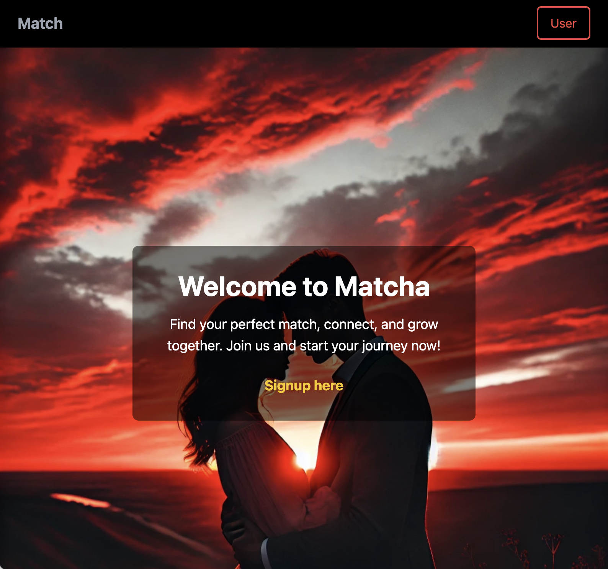

# Matcha — Modern Dating Platform

> Because love too can be industrialized.

## Description

**Matcha** is a complete dating web application that allows users to register, create detailed profiles, browse and filter other users, express interest, chat in real-time, and receive notifications — all with a responsive and secure design.

This project was entirely developed by me and jreivilo as part of the 42 curriculum.

## Main Features

- Secure authentication (email confirmation, password reset, logout)
- Profile management (gender, orientation, bio, tags, profile pictures...)
- Geolocation (with manual override)
- Smart profile suggestions and matching
- Advanced filtering and sorting (age, location, fame rating, shared tags)
- Real-time notifications (views, likes, messages...)
- Real-time chat between matched users
- Block and report system
- Mobile-friendly and responsive UI
- Bonus Google OAuth2 login **implemented** but available **only for test accounts** (Google in dev mode)
- Bonus Interactive user map
- Bonus image additions via OAuth2
- Bonus Video call system
- Bonus Date planning system
- Bonus typing in chat

## Getting Started

## Environment Variables

All environment-specific configurations are defined in a `.env` file, which must be placed at the root of the project. A sample file is provided below:

### Example: `.env.example`

```env
# Backend settings
BACKEND_HOST=0.0.0.0
BACKEND_PORT=8000
API_SECRET=your_super_secret_key
JWT_ALGORITHM=HS256 # it's an example

# PostgreSQL
POSTGRES_USER=postgres
POSTGRES_PASSWORD=your_password
POSTGRES_DB=matcha
POSTGRES_HOST=db
POSTGRES_PORT=5432
DATABASE_URL=postgresql+asyncpg://postgres:your_password@db:5432/matcha

# OAuth GOOGLE
GOOGLE_CLIENT_ID=your_google_client_id
GOOGLE_CLIENT_SECRET=your_google_client_secret
GOOGLE_AUTH_URL=https://accounts.google.com/o/oauth2/auth
GOOGLE_TOKEN_URL=https://oauth2.googleapis.com/token
GOOGLE_API_BASE=https://www.googleapis.com/oauth2/v2/
GOOGLE_SCOPE=openid email profile

# Email
EMAIL_SERVER=smtp.yourprovider.com
EMAIL_PASSWORD_GOOGLE=your_email_password
EMAIL=noreply@yourdomain.com

# Frontend
LOCAL_IP=127.0.0.1 # for local
FRONTEND_ORIGIN=https://${LOCAL_IP}
FRONTEND_URL=https://${LOCAL_IP}
REACT_APP_API_URL=https://${LOCAL_IP}/api
```

### Docker + Makefile

This project runs fully in Docker. Three main commands are available via the `Makefile`:

- `make dev` — Launch the app in **development mode** via NGINX (`https://127.0.0.1`)
- `make prod` — Launch the app in **production mode** via NGINX (`https://127.0.0.1`)
- `make insert_all` — Populate the database with test profiles  
  ⚠️ Use this command **only if** your database is empty!

### Access the App

Once launched:
- Visit [`https://127.0.0.1`](https://127.0.0.1)
- Email-based login works correctly
- Google OAuth2 login is **implemented** but in **development mode**, meaning it only works with pre-authorized Google accounts
doc:
- http://127.0.0.1:8000/docs#/

## Screenshots

You can insert images to illustrate features:

Figure 1: Homepage view on desktop.


Figure 2: Profile page view on desktop.


Figure 3: Search page view on desktop.


Figure 4: Chat Interface view on desktop.


Figure 4: Email received.


## Tech Stack
- Frontend: React + Tailwind CSS
- Backend: FastAPI (async) + WebSockets
- Database: PostgreSQL
- Authentication & Security: JWT, HttpOnly cookies, bcrypt hashing, email validation
- WebSockets: Real-time chat & notifications
- Docker: Multi-container (frontend, backend, db, nginx)
- NGINX: HTTPS proxy with self-signed certs in dev

## Important Notes
- All secrets and API keys are stored in a .env file and excluded from Git
- A "like" must be mutual to open a chat (matching system)
- Users can be blocked or reported at any time
- SQL queries are manually written and protected from injection
- All forms and uploads are validated and secure

## Bonus Features (done or in progress)
- ✅ Interactive user map
- ✅ image additions via OAuth2
- ✅ Video call system
- ✅ Google OAuth2 login (fully implemented, Google-side still in dev mode)
- ✅ Date planning system (experimental)
- ✅ typing in chat

## Areas for Improvement

Several enhancements have been identified to optimize the user experience and application performance:

- **Unify WebSocket connections**: centralize WebSocket channels (chat, notifications, calls...) to reduce the number of open connections and simplify frontend handling.
- **Add pagination** when searching profiles to reduce initial loading time and improve responsiveness.
- **Message read indicators**: display whether a message has been read in the chat interface for better conversation clarity.
- **Redesign the profile page** for a more polished look and improved layout of user information.

## Author
- Project developed by Nicolas Hirzel and Jérémy Olivier
- GitHub: [@Np93](https://github.com/Np93)
- GitHub: [@jreivilo](https://github.com/jreivilo)
- sSchool: 42 Lausanne